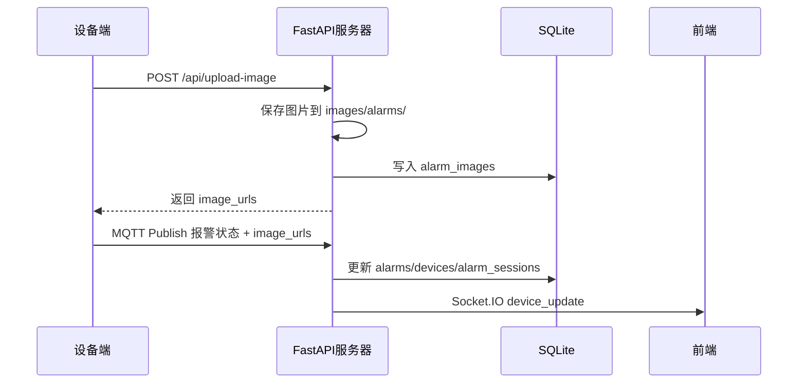

# 叉车端图片上传功能接入指南

## 概述

服务器端当前采用 **FastAPI + MQTT + Socket.IO**。报警图片走 HTTP 批量上传，报警状态走 MQTT 上报，前端通过 REST API 和 Socket.IO 获取最新状态。



## 图片上传接口

- 方法：`POST`
- 路径：`/api/upload-image`
- Content-Type：`multipart/form-data`
- 实现位置：[`backend/api.py`](../backend/api.py)、[`backend/services/app_service.py`](../backend/services/app_service.py)

表单字段：

| 参数名 | 类型 | 必填 | 说明 |
|--------|------|------|------|
| `device_id` | string | 是 | 设备唯一标识，如 `FORK-001` |
| `images` | file[] | 是 | 图片文件列表，字段名固定为 `images` |
| `base_timestamp` | string | 否 | 基准时间，格式 `YYYY-MM-DD HH:mm:ss` |
| `image_timestamps` | string | 否 | JSON 字符串数组，需与图片数量一致 |

响应示例：

```json
{
  "image_urls": [
    "/images/alarms/FORK-001_2026-03-19_14-30-00_0.jpg"
  ]
}
```

curl 示例：

```bash
curl -X POST http://localhost:5000/api/upload-image \
  -F "device_id=FORK-001" \
  -F "base_timestamp=2026-03-19 14:30:00" \
  -F "images=@alarm_snapshot.jpg"
```

## MQTT 报警消息

推荐流程是：设备先上传图片，拿到 `image_urls` 后再发布 MQTT 报警消息。

主题：

```text
factory/forklift/{device_id}/alarm
```

消息示例：

```json
{
  "device_id": "FORK-001",
  "alarm": 1,
  "timestamp": "2026-03-19 14:30:00",
  "image_urls": ["/images/alarms/FORK-001_2026-03-19_14-30-00_0.jpg"]
}
```

字段说明：

| 字段 | 类型 | 必填 | 说明 |
|------|------|------|------|
| `device_id` | string | 是 | 设备唯一标识 |
| `alarm` | integer | 是 | `0` 正常，`1` 报警 |
| `timestamp` | string | 是 | 设备上报时间 |
| `image_urls` | array[string] | 否 | 批量图片路径 |
| `image_url` | string | 否 | 兼容旧设备的单图路径 |

MQTT 处理入口在 [`backend/workers.py`](../backend/workers.py)，业务解析在 [`backend/services/app_service.py`](../backend/services/app_service.py) 的 `process_mqtt_payload()`。

## 存储结构

图片文件保存到：

```text
cloud/images/alarms/
```

图片元数据保存到 SQLite 表 `alarm_images`：

| 字段 | 说明 |
|------|------|
| `device_id` | 设备 ID |
| `image_path` | 图片相对路径 |
| `timestamp` | 图片时间 |
| `description` | LLM 生成的报警图片描述 |
| `description_status` | `pending`、`done` 或 `failed` |

相关配置在 [`backend/settings.py`](../backend/settings.py)：

```python
ALARMS_IMAGE_DIR = IMAGES_DIR / "alarms"
ALLOWED_IMAGE_EXTENSIONS = {"png", "jpg", "jpeg", "gif", "bmp", "webp"}
MAX_IMAGE_SIZE_MB = 16
```

## Python 设备端示例

```python
import json
from datetime import datetime

import paho.mqtt.client as mqtt
import requests

SERVER_URL = "http://localhost:5000"
MQTT_BROKER = "localhost"
MQTT_PORT = 1883
DEVICE_ID = "FORK-001"


def upload_image(image_path):
    with open(image_path, "rb") as f:
        files = [("images", ("alarm_snapshot.jpg", f, "image/jpeg"))]
        data = {"device_id": DEVICE_ID}
        response = requests.post(f"{SERVER_URL}/api/upload-image", files=files, data=data, timeout=10)
    response.raise_for_status()
    return response.json().get("image_urls", [])


def send_alarm(alarm_status, image_urls=None):
    payload = {
        "device_id": DEVICE_ID,
        "alarm": alarm_status,
        "timestamp": datetime.now().strftime("%Y-%m-%d %H:%M:%S"),
    }
    if image_urls:
        payload["image_urls"] = image_urls

    client = mqtt.Client(mqtt.CallbackAPIVersion.VERSION2)
    client.connect(MQTT_BROKER, MQTT_PORT, 60)
    client.publish(f"factory/forklift/{DEVICE_ID}/alarm", json.dumps(payload))
    client.disconnect()
```

